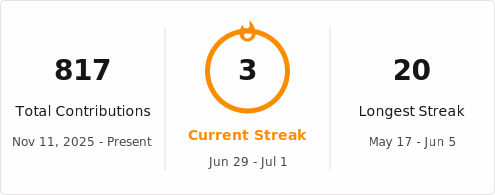

<h1 align="center">Hi, I'm Soham Malhotra 👋</h1>

  <b>Fullstack AI/ML Engineer @ Glintt Global</b> &nbsp;•&nbsp; <b>MSc Robotics @ EPFL</b>

<h3 align="center">Background</h3>

  🎓 BSc Computer Science — EPFL 🇨🇭 (Exchange Year @ KTH 🇸🇪) — 2022 – 2025

<h3 align="center">Currently</h3>

  Building production AI/ML systems — from agentic LLM pipelines served via scalable, observable backends at Glintt, while pursuing a MSc in Robotics @ EPFL!

  
  
  

  

---

### Languages

### Backend / Web

### AI / ML

### Infra, Messaging & DevOps

### Observability

---

<h3 align="center">Contribution Stats</h3>

Contribution Stats for the last month

  

---

<h3 align="center">Overall Contributions Year-to-Date</h3>

  <picture>
    <source media="(prefers-color-scheme: dark)" srcset="https://raw.githubusercontent.com/sohamm29/sohamm29/output/github-snake-dark.svg" />
    <source media="(prefers-color-scheme: light)" srcset="https://raw.githubusercontent.com/sohamm29/sohamm29/output/github-snake.svg" />
    
  </picture>

---

<!--
<h3 align="center">Personal GitHub Stats</h3>

-->

  

